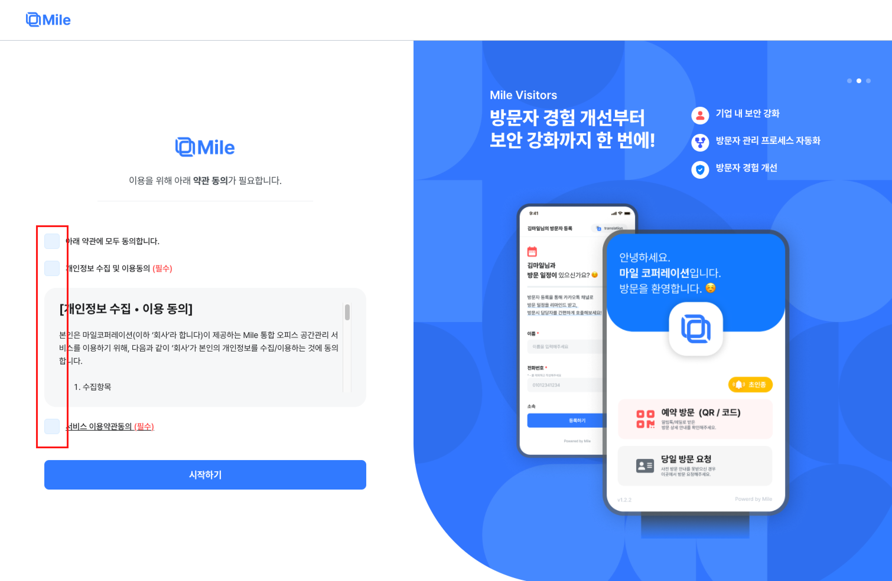

<Warning>마일 관리자 사이트 로그인으로, 구글 워크스페이스의 최고권한 사용자만 로그인이 가능합니다.</Warning>

> 처음 회원가입 하는 계정은 Mile내 회사의 워크스페이스 owner 역할을 수행하게 됩니다.
>
> 따라서 최초 로그인할 계정은 반드시 워크스페이스 내 최고 권한 관리자 역할이어야 합니다.
> 보다 자세한 내용은 마일팀에 [문의(권장)]("https://mile.channel.io/home") 혹은 [구글 워크스페이스 기본 제공 관리자 역할]("https://support.google.com/a/answer/2405986?hl=ko&ref_topic=9832445&sjid=12978668995399414398-AP")를 확인해주세요.

 
## 1. 구글 계정으로 로그인하기

[마일 로그인하러 가기](https://app.mile.im/login/auth) 링크를 클릭해서, 로그인 화면으로 이동합니다.

이후, 우측 가운데 [Sign in with Google]버튼을 클릭하시어 구글 워크스페이스 계정과 연동하여 로그인할 수 있습니다.

로그인 시 약 10초 정도의 로딩 시간이 걸리며, 최초 로그인 시 워크스페이스 캘린더 정보와 멤버 정보가 연동됩니다.

<Frame>
  </img>
</Frame>

 
## 2. 약관 동의하기

최초로 로그인을 시도하셨다면, 개인정보 수집 및 이용 동의를 선택해주어 계정을 생성하실 수 있습니다.

<Frame>
  </img>
</Frame>

 
## 3. 추가 설정 이어하기

모든 과정이 끝났다면 아래와 같이 구글 워크스페이스 내의 정보들이 사이트 메인화면에 표시가 됩니다.

해당 관리사 사이트에서 슬랙, 구글 캘린더 연동 및 태블릿 기능 커스텀을 진행해보실 수 있습니다.

<Frame>
  </img>
</Frame>

**다음으로 설정해야하는 목록들은 다음과 같습니다.**

-   [구글 캘린더 연동하기]("https://mile.mintlify.app/google")
-   [슬랙 연동하기]("https://mile.mintlify.app/slack")
